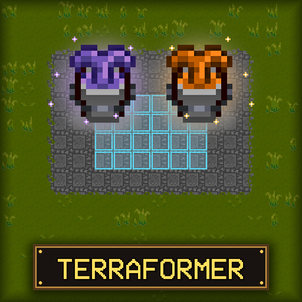
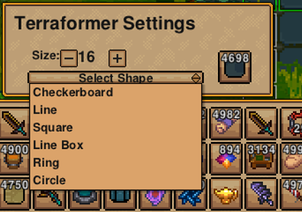
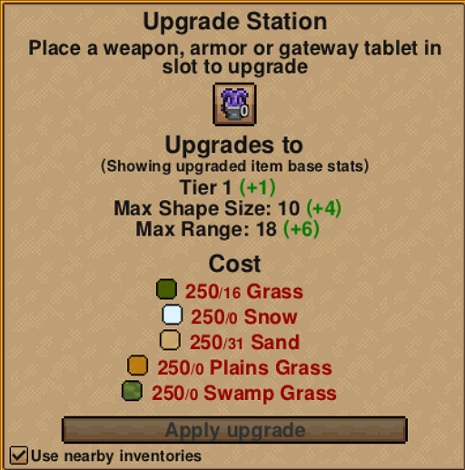

# Terraformer

A landscaping and construction tool for Necesse that allows bulk placement and removal of tiles, objects, and liquids.

## Overview

Adds two tools purchased from the Elder (5,000 coins each):
* **Terraformer**: Place and remove tiles (dirt, stone, grass, wood, etc.) and liquids (water, lava).
* **Builder**: Place and remove objects, walls, and furniture.

## Features

### Shapes and Sizes
Choose from square, checkerboard, line, circle, ring, or line box shapes. Open the settings menu by right-clicking the item in your inventory.

You can also adjust the shape size with in-game hotkeys:
* `.` (Period): Size up
* `,` (Comma): Size down

### Bulk Placement & Removal

### Scoop and Place Liquids

## How It Works

* **Left-Click**: Place stored tiles/objects in the selected shape.
* **Right-Click**: Scoop/remove matching tiles, liquids, or objects.
* **Right-Click (in inventory)**: Open settings menu.
* When scooping, only the tile/object type currently stored in the tool will be collected. If the tool is empty, the first tile targeted (marked in orange) is selected.
* Any collected items that exceed the tool's capacity go to your inventory.
* Line direction is based on the character's facing direction.
* Both items can be upgraded at the Upgrade Station for increased range and shape size.

## Credits

* Maintained by Xeraphire
* Original Mod by FerrenFx: [Steam Workshop](https://steamcommunity.com/sharedfiles/filedetails/?id=3453342401)